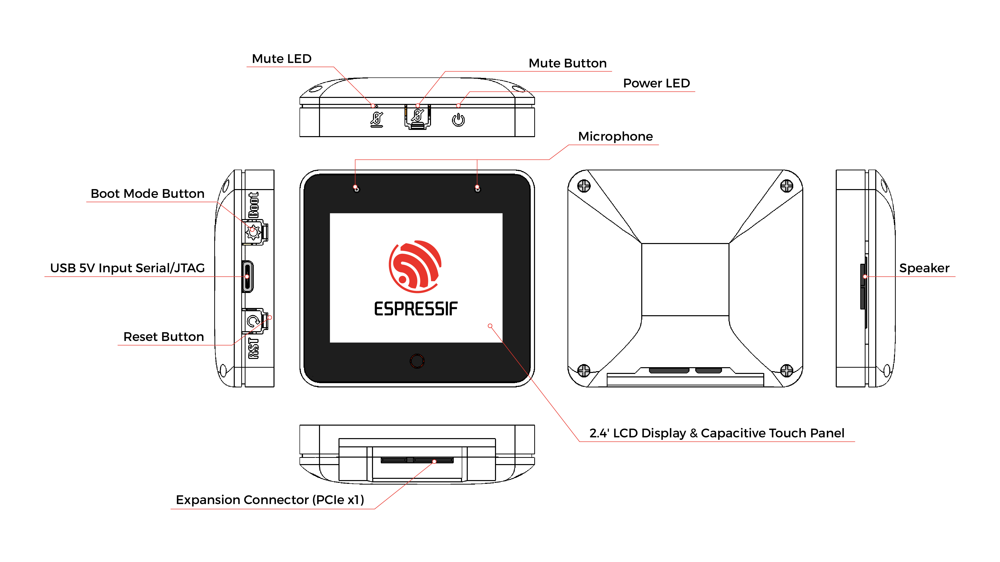

# BSP: ESP-BOX-3

* [Hardware Reference](https://github.com/espressif/esp-box/tree/master/hardware)

ESP32-S3-BOX-3 is an AI voice development kit that is based on Espressif’s ESP32-S3 Wi-Fi + Bluetooth 5 (LE) SoC, with AI capabilities. In addition to ESP32-S3’s 512KB SRAM,

ESP32-S3-BOX-3 comes with 16MB of QSPI flash and 16MB of Octal PSRAM. ESP32-S3-BOX-3 is also equipped with a variety of peripherals, such as a 2.4-inch display with a 320x240 resolution, a capacitive touch screen, a dual microphone, a speaker, and two Pmod™-compatible headers which allow for the extensibility of the hardware.

ESP32-S3-BOX-3 also uses a Type-C USB connector that provides 5 V of power input, while also supporting serial and JTAG debugging, as well as a programming interface; all through the same connector.

